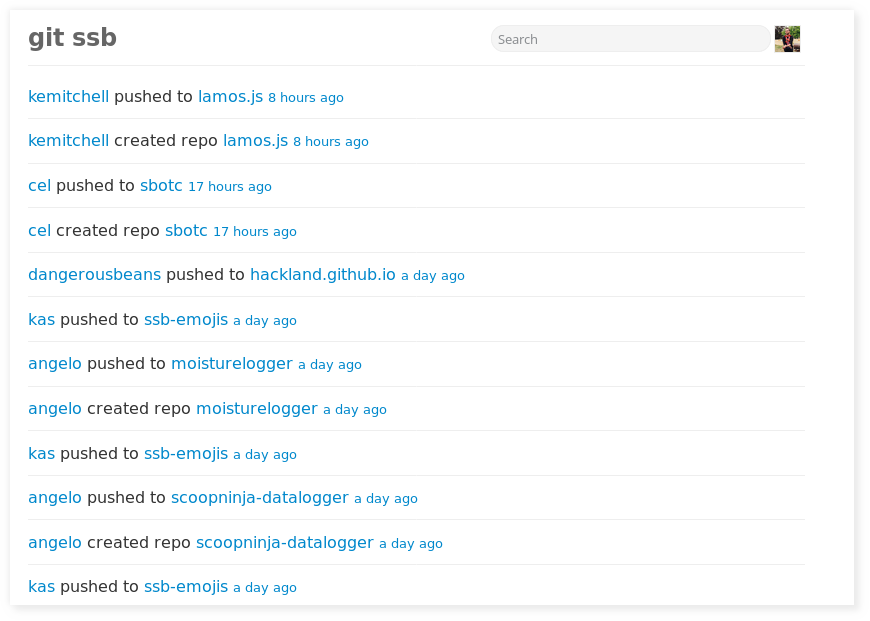
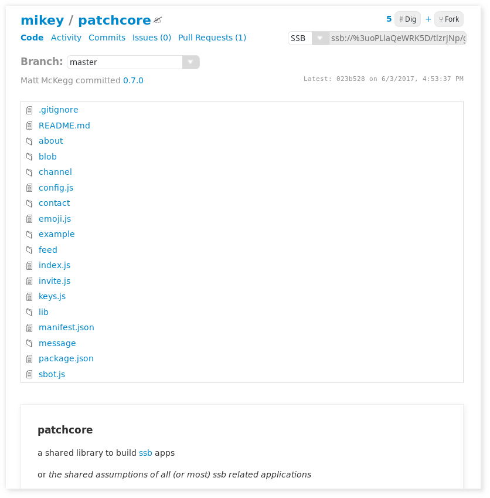

# git-ssb-intro

> a guide to hacking *together* on the distributed web

If you're curious about the distributed web, and the prospect of using git
collaboratively without a central, closed-source point of origin, you came to
the right place!

git-ssb is a great fit for just this. This guide tries to act as a transition
aide for GitHub users into the world of git-ssb. It assumes rudimentary
knowledge of GitHub. It will walk through:

1. understanding what "SSB" is.
2. installing scuttlebot -- the SSB peer server -- and joining the network.
3. installing the `git-ssb` command and the `git-ssb-web` web interface.
4. a walkthrough of using git-ssb to do common GitHub workflows (creating repos,
   making pull requests, merging pull requests, issues, etc).



_A view of recent activity among my friends on git-ssb_

## What is SSB?

SSB stands for [secure scuttlebutt](https://github.com/ssbc/secure-scuttlebutt),
the database/protocol that powers the *peer-to-peer log store* [scuttlebutt](http://scuttlebot.io). There is a great deal of information to be found by reading these sites, if you're so inclined.

If you're familiar with bitcoin or blockchains, SSB is akin to having your
own personal blockchain: you can append messages of any kind, with any data
you'd like. Unlike bitcoin, there's no money involved: it's just a data
structure on your local machine.

Your personal log can only be appended to, and is cryptographically secure: each
message references the hash of the message that came before it. The whole thing
is then also signed by your public key, making it both tamper-proof, and
appendable only by the private key holder (you).

The final piece of SSB that makes it all work is the gossip protocol: when you
run scuttlebot, you become a peer in a network of other scuttlebot users. You
can choose to 'follow' other people's personal logs. As a result, whenever you
see that user (or any user that follows that user too) online, you can retrieve
their latest log entries from them. All without any central server or central
authentication.

[git-ssb](http://git.scuttlebot.io/%25n92DiQh7ietE%2BR%2BX%2FI403LQoyf2DtR3WQfCkDKlheQU%3D.sha256) builds on top of this: things like commits, branches, issues, and pull requests are encoded into log entries on each participant's personal log, while the gossip protocol runs in the background and propagates new content to everyone involved in the git repository.


## Setup 

If you're already up and running on Patchwork (or another client), you can skip to step 3.

### 1. Install node + npm

You can install node and npm..

1. from https://nodejs.org, or
1. using [nvm](https://github.com/creationix/nvm)

### 2a. Install Patchwork


Patchwork is an easy and user-friendly client that's nice to start your SSB
experience with, if you're new. Follow the instructions on the main page at https://scuttlebutt.nz

If you'd rather not use Patchwork, follow the next section.

### 2b. Install scuttlebot

The [scuttlebot](http://www.github.com/SSBC/scuttlebot) (or sbot) is an ssb server which will manage replicating data with other peers.

Make sure you [get an invite code](https://github.com/ssbc/scuttlebot/wiki/Pub-Servers) from a pub to increase your ability to find other scuttlers.


### 3. Install ssb-npm

All of the dependencies for git-ssb *and git-ssb itself* live on the SSB
network. To access them, we'll need to install [ssb-npm](http://git.scuttlebot.io/%25iqhz%2FsQCZCSp91JYAqfQPzHuDYrjw1geKPf1wJ1CvlA%3D.sha256):

First, install the ssb-npm-registry plugin:

```
sbot plugins.install ssb-npm-registry --from 'http://localhost:8989/blobs/get/&mQWE3Ziulf3hJ4ncGRnqQeDeokeKhQjNcCPQRLEcIho=.sha256'
```
then install the ssb-npm command:
```
npm install --registry=http://localhost:8043/ -g ssb-npm
```

### 4. Install git-ssb

[git-ssb](http://git.scuttlebot.io/%25n92DiQh7ietE%2BR%2BX%2FI403LQoyf2DtR3WQfCkDKlheQU%3D.sha256) is primarily the work of [cel](http://git.scuttlebot.io/%40f%2F6sQ6d2CMxRUhLpspgGIulDxDCwYD7DzFzPNr7u5AU%3D.ed25519), and comes in the form of a command-line program not unlike `git` or GitHub's [hub](https://github.com/github/hub).

Let's use `npm` to install `git-ssb` globally so we can use it in the command-line:

```
$ ssb-npm install --global git-ssb
```

You can now run `git-ssb` (or `git ssb`) from the command line and get a feel for the sorts of things it can do.

**NOTE** - You need to make sure you are running a scuttlebot server when executing git-ssb commands. You can run one standalone, but the simplest way is to just run Patchwork.


## The git-ssb web interface

If you've already joined the SSB network successfully, you can take a look at
what other hackers on SSB are working on! Run `git-ssb web` and point your web
browser at the URL it outputs. (Remember you need to be running scuttlebot or Patchwork.)



_A repo on git-ssb_

You'll see that it's not dissimilar from GitHub: [git-ssb-web](http://git.scuttlebot.io/%25q5d5Du%2B9WkaSdjc8aJPZm%2BjMrqgo0tmfR%2BRcX5ZZ6H4%3D.sha256)
lets you see commit activity, view repositories, browse commit history, see
issues and pull requests. All without a centralized authority.

There are at least a few public git-ssb web servers run by the community, for
browsing git-ssb content without running your own scuttlebot:

- https://git.scuttlebot.io

## Creating your first SSB git remote

git-ssb makes scuttlebot act like a git remote. Navigate to an existing git
repository of yours and run

```
$ git-ssb create ssb my-little-repo
```

This will create a new git repo on SSB. The command will output something that
looks like

```
Created repo: ssb://%DEvlJYD+zuudMyNWFBjiiNvZ8DbOyBYhCkE5EVtWSV0=.sha256
(my-little-repo)
```

The string `%DEvlJYD+zuudMyNWFBjiiNvZ8DbOyBYhCkE5EVtWSV0=.sha256` is a hash that
uniquely identifies your git-ssb repository. To see this in action, you can
navigate to (for example) `~/projects` and run

```
$ git clone ssb://%DEvlJYD+zuudMyNWFBjiiNvZ8DbOyBYhCkE5EVtWSV0=.sha256 my-repo
```

and you'll see that `~/projects/my-repo` now exists. git-ssb talked to your local
scuttlebot server and pulled down the entire git repository.

In fact, you can also view your handiwork by running `git-ssb web` and opening
your browser: you'll see your brand new repo near the top of the activity list
and can browse it like you might've on GitHub.


## Collaboration: forks and pull requests

If you're reading this article, then you've already found one SSB git
repository: this one! Let's create a fork, make some changes, and send a pull
request:

### Clone

```
$ git clone ssb://%RPKzL382v2fAia5HuDNHD5kkFdlP7bGvXQApSXqOBwc=.sha256 git-ssb-intro

$ cd git-ssb-intro
```

### Fork

Let's look at the help with `git-ssb fork --help`:

```
Usage: git ssb fork [<upstream>] <remote_name>

  Create a new git-ssb repo as a fork of another repo
  and add it as a git remote

Arguments:
  upstream      id, url, or git remote name of the repo to fork.
                default: 'origin' or 'ssb'
  remote_name   Name for the new remote
```

since we just did a fresh git clone, the remote to the original repo is
`origin`; you can type `git remote -v` and have a look. since `origin` (or
`ssb`) are the default for forks, you can omit this option.

`remote_name` is whatever you'd like to call the remote of your fork. I usually
call mine `noffle-ssb`, to indicate that it's a fork remote and that it's my
personal one:

```
$ git-ssb fork noffle-ssb
Created repo: ssb://%DKWLuN05qtwjdwTG7zCG4aU12muBK2pkpYgaBbeVkTM=.sha256 (git-ssb-intro)
Added remote: noffle-ssb
```

Great! Now we can make some changes and commit them. I forgot to add a license
to this document, so we can add that, commit, and push:

```
$ cat >> README.md

# license

ISC
^D

$ git commit -am 'adds license'
[master 3a7c5f7] adds license
 1 file changed, 4 insertions(+)

$ git push noffle-ssb
Counting objects: 3, done.
Delta compression using up to 2 threads.
Compressing objects: 100% (2/2), done.
Writing objects: 100% (3/3), 2.55 KiB | 0 bytes/s, done.
Total 3 (delta 0), reused 0 (delta 0)
Decoding objects: 100% (3/3)
Pushing blobs...pwMeF/zIvuwFc4/T3VBwpHr+r6H+dHvWKFyIxCs1+08=.sha256
Published %i0Fcr3zRdf50Tin1UdEmYU38eKWthmkO3XgpfMYU1AU=.sha256ha256
To ssb://%DKWLuN05qtwjdwTG7zCG4aU12muBK2pkpYgaBbeVkTM=.sha256
   6a701c2..3a7c5f7  master -> master
```

We can see our fork on the web interface, too! navigate to
`http://localhost:7718` and you'll see your repo fork.

Let's finally create a pull request with our changes:

```
$ git-ssb pull-request
```

this will launch your text editor and let you type in a message. It's good
practice to make the first line of your message the subject, and leave two
newlines before writing your message. something like

```
test pull request

please merge me
```

Sure enough, you can now navigate to the `from-github-to-git-ssb` repo on SSB
and see your pull request:
http://localhost:7718/%25RPKzL382v2fAia5HuDNHD5kkFdlP7bGvXQApSXqOBwc%3D.sha256/pulls

If you were the owner of the git repo, you could merge this pull request from
the command line by pulling down the fork remote and merging:

```
git fetch ssb://%RPKzL382v2fAia5HuDNHD5kkFdlP7bGvXQApSXqOBwc=.sha256 noffle-ssb:noffle-ssb
git merge noffle-ssb
git push ssb
```

## Alternative: collaboration without forks

git-ssb's permissionless model has an interesting consequence: *anybody can push
to anybody else's git repository*. Coming from a GitHub background this probably
sounds like madness, but folks on SSB have been using this model with good
success. A pull request might look like this:

```
$ git clone ssb://%RPKzL382v2fAia5HuDNHD5kkFdlP7bGvXQApSXqOBwc=.sha256 foobar

$ git checkout -b @noffle/master

$ cd foobar

$ vim index.js
(edit edit edit)

$ git commit -am 'wark'

$ git push ssb

$ git ssb pull-request
```

The nomenclature is to treat the `ssb` remote as the "true" remote, and work off
of a branch called `@your-username/master` as your own master, emulating a
forked repo. This seems to work well: the SSB network thrives off of being a
group of kind, respectful folks who don't push to each other's `master` branch.
:)

## Push conflicts

Since git-ssb allows users to push to the same remote asynchronously, there is a
possibility that they will conflict. This is different from a git merge
conflict: in this case, there are two (or more) competing HEADs for e.g.
`master`.

If this happens, git-ssb will consider the branch as being in a conflict state.
It will automatically add a new "conflict branch" for each conflicting HEAD. The
name of each conflict branch will be prefixed by its SSB message ID. To resolve
the conflict, one should merge the conflict branches locally as appropriate, and
then push the new head and delete the conflict branches. e.g.:

```
git checkout master
git fetch origin
git merge origin/%msg1/master [origin/%msg2/master...]
# resolve merge conflict
...
git push origin master -d %msg1/master [-d %msg2/master...]
```

## Go forth and collaborate!

Well done, and welcome to the scuttleverse and the world of distributed social
coding! share git-ssb with your friends, and consider managing an SSB remote of
your GitHub work, to encourage further growth of the distributed web.

Thanks for reading! please share feedback or questions as issues on this repo,
or, if you find any errors in the text, send a pull request.

# Contributors

- @noffle: wrote this doc
- @cel: answered my many questions, and wrote most of the section on "push
  conflicts"
- @mixmix: several clarifications and improvements

# License

CC0
